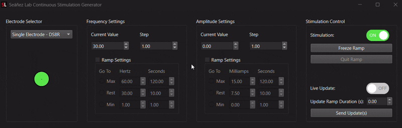
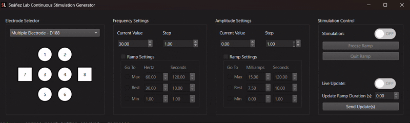

# Continuous Stimulation Generator
This application is used to deliver continous stimulation at variable frequencies and amplitudes. It was developed for the Seáñez Lab at Washington University in St. Louis.

## Table of Contents
- [Hardware Requirements](#hardware-requirements)
- [Installation](#installation)
  - [Shortcut Setup](#shortcut-setup)
- [User Guide](#user-guide)
  - [Electrode Selector](#electrode-selector)
  - [Important Safety Note](#important-safety-note)
  - [Adjusting Parameters](#adjusting-parameters)
  - [Beginning Stimulation](#beginning-stimulation)
    - [Parameter Update Immediacy](#parameter-update-immediacy)
  - [Parameter Ramping](#parameter-ramping)
    - [Freezing a Parameter Ramp](#freezing-a-parameter-ramp)
    - [Quitting the Ramp](#quitting-the-ramp)

## Hardware Requirements
- National Instruments data acquistion device (NI-DAQ/DAQ)
- Digitimer DS8R Electrical Stimulator
- Digitimer D188 channel switcher (optional)

## Installation
The steps below outline installation using a Conda virtual environment, which requires Anaconda or Miniconda as a prerequisite. 
If you don't have Anaconda or Miniconda installed, Miniconda is recommended.

1. From Anaconda PowerShell Prompt, run the `cd` command until you are in the directory from which you want to run the application.

1. Clone this repo inside the directory from above. The command below will create a folder called `stim_train_generator` inside the chosen directory.
```
git clone git@github.com:zachmichael14/stim_train_generator
```

2. Create the virtual environment by running the following command. This will create a Conda virtual environment called `stim`.
```
cd stim_train_generator
conda env create -f environment.yml
```

3. Activate the created environment.
```
conda activate stim
```

4. Run the application.
```
python main.py
```

### Shortcut Setup
It's possible to run this application from a desktop shortcut using PowerShell (Windows only).

To create a shortcut, open the Windows File Explorer and navigate to the `stim_train_generator` directory. Right-click the `StimShortcut.ps1` file, then select `More Options > Send to > Desktop (create shortcut)`.  


Next, right click the newly created shortcut and select `Properties`. In the `Target` box under the `Shortcut` tab, paste the following, replacing `<path_to_StimShortcut.ps1>` with the actual path to the `StimShortcut.ps1` file:
```
powershell.exe -ExecutionPolicy Bypass -WindowStyle Hidden -File <path_to_StimShortcut.ps1>
```
Finally, Click Apply, then click OK.  


## User Guide
### Electrode Selector
Two modes are available: single electrode mode and multiple electrode mode. Single electrode mode is selected by default with its sole electrode already enabled. Single electrode mode only requires the DS8R, while multiple electrode modes requires the use of the D188 channel switcher in conjunction with the DS8R.

To deliver stimulation via the selected electrode, switch the `Stimulation` toggle to the ON position, and stimulation will be delivered using the frequency and amplitude values specified.

When both the electrode button and the `Stimulation` toggle are enabled, de-selecting the electrode will stop stimulation, as evidenced by the `Stimulation` toggle switching to the OFF position. This behavior is the same for both single and multiple electrode mode.


*Toggling electrode off in single electrode mode also toggles stimulation off*


*Toggling electrode off in multiple electrode mode also toggles stimulation off*

On the other hand, if both the electrode button and the `Stimulation` toggle are toggled off, switching the `Stimulation` toggle to the ON position will trigger different behavior depending on the electrode mode:
- In single electrode mode, the electrode button is automatically enabled since there is no way to have stimulation delivery with a disabled electrode (though that is possible with the D188 when using multiple electrode mode, as you'll see).


*Toggling stimulation on in single electrode mode enables the sole electrode*

- When `Stimulation` is toggled on in multiple electrode mode, the application makes no assumption about the channel on which stimulation should be delievered, so it does not enable one be default.  


*Toggling stimulation on in multiple electrode mode does not enable an electrode by default*

### Important Safety Note
If multiple electrode mode is used when there is no D188 physically connected, the aforementioned lack of an enabled electrode may make it appear as though no stimulation is being delivered even though the DS8R may, in fact, be delivering stimulation.

Put another way, when the DS8R's output is connected to the D188 channel switcher, the channel switcher will safely prevent this stimulation from being delivered until an electrode is selected in mulitple electrode mode. *However, if there is no D188 physically connected to the DS8R when multiple electrode mode is used, there is nothing to prevent the DS8R's stimulation from being delivered.*

Therefore, use single electrode mode when your physical hardware configuration resembles the following:  

  
*Hardware configuration for single electrode mode*

Use multiple electrode mode only if your hardware set up involves a D188 and resembles the following:  

  
*Hardware configuration for multiple electrode mode*

### Adjusting Parameters
The `Current Value` input represents the value of the parameter that will be used when stimulation is delivered, with frequency in Hertz (Hz) and amplitude in milliamps (mA).  

The `Current Value` will increase or decrease by the value in the `Step` input box each time the up or down arrow of `Current Value` is clicked, respectively. The up and down arrow keyboard keys may also be used to change the value in these boxes.  

  
*The amount by which parameter values change is determined by the specified step*

#### Note
As a precautionary measure, the most that `Current Value` can increase at once is limited to 50 Hz for frequency and 15 mA for amplitude. As such, it's not possible to set the value of `Step` above these limits. There is no cap on the amount a parameter can decrease.

### Beginning Stimulation
When the `Stimulation` toggle is switched to the ON position, stimulation will be delivered on the selected channel using the parameter values in the `Current Value` boxes.

#### Parameter Update Immediacy
There are two ways to update stimulation parameter values while `Stimulation` is ON: live or delayed. 

When the `Live Update` toggle is switched to the ON position, any changes to channel, frequency, or amplitude will be immediately applied. When `Live Update` is OFF, changes to these parameter values will only be applied after clicking the `Send Update(s)` button.

The `Update Ramp Duration` input can be used to apply these updates over a specified time period, in seconds. The output of the ramp (i.e., the parameter at which stimulation is currently being delivered) will be reflected in the `Current Value` boxes in real time.  
  

*Specifying a ramp update duration will apply updates over that duration when updates are not live*

### Parameter Ramping
In addition to ramping delayed updates, the values specified in `Ramp Settings` are intended to conveniently allow ramping between the current value and one of three distinct values over the specified duration. 

Importantly, these values are not enforced as labeled (that is to say that it's possible for `Max` to be set to a value less than the value specified in `Min`). Rather, these labels represent the intended use of these values.

For example, `Max` may represent the parameter delivered at some peak condition (ex., flexion/extension task, F-wave examination), `Rest` may be some baseline value (a pre-activation or sensation habituation value, for instance), and `Min` could be some lowest pertinent value (ex., a sensory or response threshold).

`Ramp Settings` can be modified by first enabling them with the checkbox, then changing the desired value. It will not be possible to begin a ramp until the `Stimulation` toggle is switched ON, at which point the buttons to the left of the ramp values will be enabled. Simply click the button to the left to begin ramping from the current value to the specified value.  


While a parameter ramp is in progress, it's not possible to trigger another ramp (as indicated by the disabled buttons). If another ramp should be triggered, the ramp should first be frozen.

#### Freezing a Parameter Ramp
If stimulation should continue using the current parameters at any point during a ramp (or if the ramp should be quit), ramping can be paused using the `Freeze Ramp` button. This will **not** stop stimulation, but will instead deliver stimulation continuously using the values at the point in the ramp when the freeze button was pressed. Clicking the `Resume Ramping` button will continue the ramp from the moment it was paused.  


#### Quitting the Ramp
It's possible to exit a ramp once it's begun be pressing the `Quit Ramp` button. The button is only available after freezing the ramp. Freezing the ramp first signals to the application that the current parameters are the values it should use for stimulation after the ramp has been exited.


