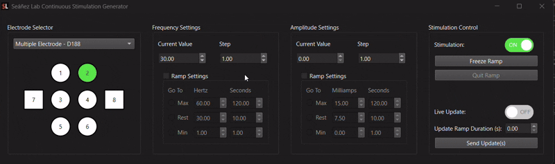

# Seáñez Lab Continuous Stimulation Generator
This application is used to deliver continous stimulation at variable frequencies and amplitudes.

## Hardware Requirements
- National Instruments data acquistion device (NI-DAQ/DAQ)
- Digitimer DS8R Electrical Stimulation
- Digitimer D188 channel switcher (optional)

## User Guide
### Cathode Selector
Two modes are available: single electrode mode and multiple electrode mode. Single electrode mode is selected by default with its sole electrode enabled. Single electrode mode only requires the DS8Rs while the use of multiple electrode modes requires the use of the D188 channel switcher in conjunction with the DS8R.

To deliver stimulation via the selected electrode (electrode selection is indicated by a green color), switch the `Stimulation` toggle to the on position, and stimulation will be delivered using the frequency and amplitude values specified.

When both the electrode button and the `Stimulation` toggle are enabled, de-selecting the electrode will stop stimulation, as evidenced by the `Stimulation` toggle switching to the `Off` position. This behavior is the same for both single and multiple electrode mode.

*Toggling electrode off in single electrode mode also toggles stimulation off*

*Toggling electrode off in multiple electrode mode also toggles stimulation off*

On the other hand, if both the electrode button and the `Stimulation` toggle are toggled off, switching the `Stimulation` toggle to the `On` position will trigger different behavior depending on the electrode mode:
- In single electrode mode, the electrode button is automatically enabled. The reason for automatic enabling is because there is no other device standing between the DS8R and the participant, so the stimulation will be delivered.

**Toggling stimulation on in single electrode mode also enables sole electrode*

- When stimulation is toggle on in multiple electrode mode, the application makes no assumption about the channel on which stimulation should be delievered, so it does not enable one be default. 

**Toggling stimulation on in multiple electrode mode does not enable an electrode by default*

### Important Safety Note
If multiple electrode mode is used when there is no D188 physically connected, the aforementioned lack of an enabled electrode may make it appear to the user as though no stimulation is being delivered even when it is being delivered. 

Put another way, if the DS8R's output is connected to a D188 channel switcher, the channel switcher will safely prevent this stimulation from being delivered until the user enables an electrode button in mulitple electrode mode. *However, if there is no D188 physically connected to the DS8R when multiple electrode mode is used, there is nothing to prevent the DS8R's stimulation from being delivered.*

Therefore, use single electrode mode when your physical hardware configuration resembles the following:

*Hardware configuration for single electrode mode*

Use multiple electrode mode only if your hardware set up involves a D188 and resembles the following:

*Harware configuration for multiple electrode mode*
